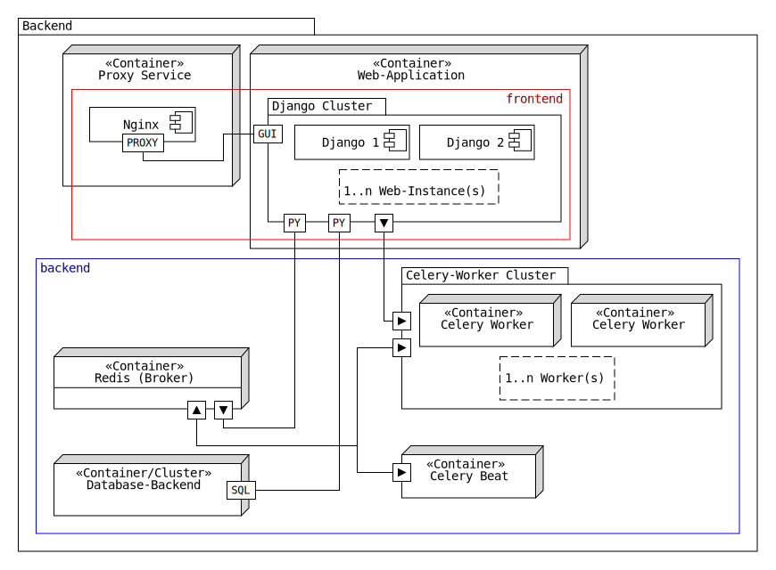

.. _intro_docker_setup:

*************************
Setup with Docker Compose
*************************

This project uses Docker Compose to manage its container environment. With Docker Compose, you
can easily set up and run all the required services and dependencies for this project with a
single command.

The following figure illustrates how the default costellation of muliple containers is meant to
be reviewed. The compose file is named ``docker-compose.local.yml`` and all relevant configuration
files are located in the ``/compose/local/`` directory.

    Figure 1: Overview of container architecture. Note that our Django container will be able to
    comunicate with containers in the backend network.

-----------------
Local Development
-----------------

To get started **locally**, follow these steps:

1. Ensure that you have Docker and Docker Compose installed on your machine. If you do not have them installed, please refer to the official Docker documentation for installation instructions.
2. Open the ``docker-compose.yml`` file in the root directory of the project to review the available services and their configuration.
3. Generate a self signed certificate and private key to enable HTTPS. Save the generated files to ``/compose/local/nginx/``:

    .. code-block:: console
        :caption: On Linux and Mac

        openssl req -x509 -newkey rsa:4096 -keyout key.pem -out cert.pem -sha256 -days 365

    .. note::
        If you have Git installed on your Windows system, open Git Bash, navigate to the
        project's directory and execute the command above.

4. Run the following command to start all the required services and dependencies:

    .. code:: console

        docker-compose up

    .. note::
        The first time you run this command, Docker Compose will build the required images
        for your services, which may take some time depending on your internet speed and
        system resources. Subsequent runs will use the pre-built images.

5. Once the services are running, you can access your application by navigating to https://localhost:<port> in your web browser, where <port> is the port number specified in the docker-compose.yml file (default ``8443``).

    .. warning::
        If the port you specified in the docker-compose.yml file is already in use by
        another application on your machine, you may need to change it to a different
        port number.

You now have a fully functional development environment for this project, powered by Docker
Compose. Before setting up a production environment, consider reading the following sections
which address different configuration options.

~~~~~~~~~~~~~~~~~~~~~
Service Configuration
~~~~~~~~~~~~~~~~~~~~~

Database
--------

As per default, there is a container named ``backend-db`` which is basically a PostgreSQL server
within the backend Docker network. The following code snippet shows what configurations should
be applied to the service:

.. code-block:: yaml
    :linenos:
    :lineno-start: 40

    backend-db:
        image: postgres:13.0-alpine
        volumes:
            # The target data volume (may be a shared directory)
            - postgres_data:/var/lib/postgresql/data/
        environment:
            # Specify environment variables here or place them in an
            # environment file. Make sure to keep the password private
            # in production environments!
            - POSTGRES_USER=mastf_django
            - POSTGRES_PASSWORD=supersecretpassword
            - POSTGRES_DB=mastf_backend_db
        networks:
            - backend

.. note::
    The environment variables ``POSTGRES_USER`` and ``POSTGRES_DB`` must point to the same value
    as ``DB_USER`` and ``DB_NAME`` do defined in your environment file.

~~~~~~~~~~~~~~~~~~~
Nginx Configuration
~~~~~~~~~~~~~~~~~~~

